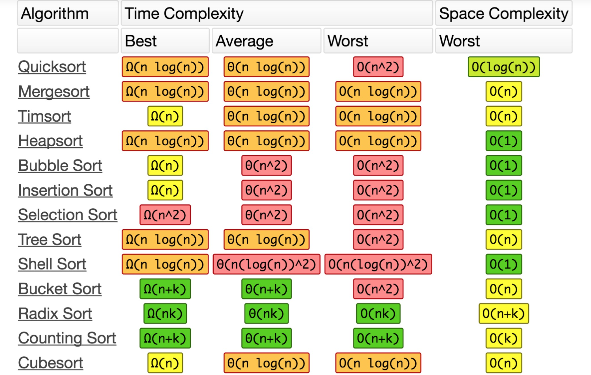

### C++ vs Java vs Python

||C++|Java|Python|
|---|---|---|---|
|Type|Object Oriented Programming|Object Oriented Programming|Object Oriented Programming|
|Pointer|Yes|No|No|
|When using other files|include|import package||
|Garbage comllection|Coder|Language||
|Efficiency|High||Low|
|When to use|Code to be run many times||Code to be run few times|

### 解释执行和编译执行

- 解释执行

 > 由解释器根据输入的数据当场执行而不生成任何的目标程序。
 
脚本语言属于解释型语言
  
- 编译执行

 > 先将源代码编译成目标语言(如:机器语言)，之后通过连接程序连接到生成的目标程序进行执行。

 
|语言类型|效率|系统依赖性|
|---|---|---|
|解释执行|低|不依赖|
|编译执行|高|依赖|

### 堆内存和栈内存

- 堆内存：

> 区别于栈区、全局数据区和代码区的另一个内存区域。堆允许程序在运行时动态地申请某个大小的内存空间。
> 必须手动释放空间，不释放则可能堆会爆
> 唯一掌握堆内存的权柄就是返回的指针。一旦丢掉指针，我们就无法在视野内释放这片空间，也就是内存泄漏(memory leak)

### int long
32位系统中，两者都是4字节

64位系统中，int 4位，long 8位

### DBMS

||MongoDB|MySQL|Redis|
|---|---|---|---|
|Primary database model|Document store|Relational DBMS|Key-value store|

||SQL|NOSQL|
|---|---|---|
|Speed|Good at write|Good at read|
|Data use schema|Yes|No|
|Relations|Yes|No|
|Data is distributed in multiple tables|Yes|No|
||Horizontal scaling is difficult or impossible while Vertical scaling is possible|Both OK|
|Lots of R/W queries or requests|Limitation|Great performance|

### Normal forms

1NF: the values in each column of a table must be atomic
2NF: every non-key attribute must depend on the whole key, not just part of it(compound key, 不能有哪一个属性只依赖于其中一列，否则分表)
3NF: has no transitive dependencies

### Database Index

> A data structure that improves the speed of data retrieval. Can be created using one or more columns of a database table

### 动态规划

背包问题 Knapsack problem

无法解决：

1. 购入连续（非离散）物品问题，例如大米或红豆，但可用贪心算法解决；
2. 在伦敦旅游时，想去巴黎景点的问题。因为伦敦至巴黎需要时间，一旦决定将卢浮宫放入背包，那么埃菲尔铁塔也将变得“便宜”，这样不满足每个子问题离散的条件。

### 哈希表

> used to index large amounts of data

可能会出现collision,解决办法：

chaining：如果有collision，就存在linked list中

open addressing:

- linear probing: 如果被占用，则向后找到第一个可填充的位子。到end了则从start再开始。找的时候，同样linear searching
- plus 3 rehash: 这样能够避免clustering
- quadratic probing:
- double hashing

避免collision的办法：把哈希表建的比你需要的长度更长一些。
> load factor = total number of items stored / size of the array
优缺点：
linear probing在正确位置的元素个数不如chaining多，但因为遍历linked list有损耗，所以如果load factor比较低，那么linear probing更优

runtime:
Best: constant time(O(1))
Worst: linear time(O(n))

一个常见的 hash algorithm： key modulo n

1. minimize collisions
2. uniform distribution of the hash values
3. easy to calculate
4. resolve any collisions

### Sort



由于快速排序时间复杂度中的常量比归并排序更小，前者的速度会更快，因为大概率会遇到平均情况。

### Dijkstra's algorithm

对于加权图使用：

1. 找出最便宜的节点
2. 对于该节点的邻居，检查是否有前往他们的更短路径，如果有，更新其开销
3. 重复这个过程，直至更新所有节点
4. 计算最终路径

### Somaphore

```
wait()  // P  --

critical section

signal() // V  ++
```

### Process and Thread

||Process|Thread|
|---|---|---|
|Definition|Any program in Execution|Segment of a Thread|
|Time to terminate|More|Less|
|Time for creation|More|Less|
|Time for context switching|More|Less|
|Term of communication|More efficient|Less efficient|
|Resource consuming|More|Less|
|Isolated|Yes|No, shared memory|


### Sharding

> Database sharding is the process of making partitions of data in a database or search engine, such that the data is divided into various smaller distinct chunks, or shards.

- horizontal sharding (sharding key)
- vertical sharding

To do:

- 术语，各种术语
- 数据库问题
- 线程进程
- 垃圾回收？java?
- 分布式
- 哈希表实现
- 并行
- objects and pointers, matrix, and adjacency list
- traveling salesman and the knapsack problem （NP）
- Dijkstra and A*
- SQL vs NoSQL
- virtual memory
- networking
- lambda表达式

Tips:

- 有的面试官注意格式
- 练习白板表达
- 即使会，也要先设计，不能直接码代码
- 可以时不时交流一下，确认在正确的方向

提前3天看对应公司的面经
面试期间要多交流
dp hard, 分类刷


系统设计：

- TinyURL
- Recommendation System
- NetFlix
- Whatsapp/weChat
- LinkedIn和Delay Scheduling
- Google三驾马车
- 大数据平台
- Uber
